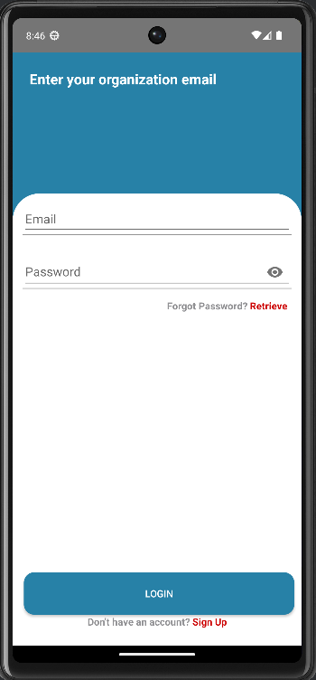
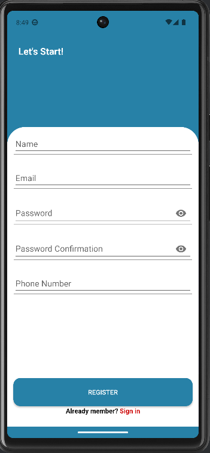
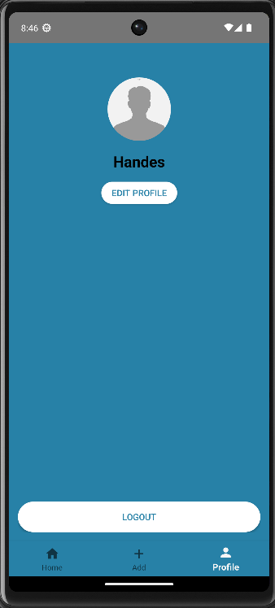

# 🚗 Valet Parking

**Valet Parking** is an application designed to simplify and improve the management of valet parking services. The application enables parking attendants to monitor available parking slots and record vehicle information in real time.

Vehicle information includes the **license plate number, vehicle color, and vehicle photo**. The application also provides a **QR Code payment feature** to simplify transactions and provide a more convenient user experience.

With an intuitive interface, Valet Parking makes it easier for parking attendants to manage parking slots, vehicle information, and payment transactions efficiently.

---

## ✨ Features

The following features have been implemented:

- 🔐 **Splash Screen**
- 🔑 **Login**
- 📝 **Register**
- 🔒 **Forgot Password**

  - Password reset request
  - Verification
  - New password
  - Password confirmation

- 🅿️ **Parking Spots**

  - View available parking slots
  - View parking slot information

- 🚘 **Parking Data Information**

  - View vehicle information
  - License plate number
  - Vehicle color
  - Vehicle photo

- ➕ **Add Car**

  - Add new vehicle information

- 📱 **QR Payment**

  - QR Code payment
  - Upload payment proof

- 👤 **Organization Profile**

  - View profile information
  - Manage account information

- ✏️ **Edit Profile**

  - Update profile information

---

## 📸 Application Screenshots

### Splash Screen

### Authentication

#### Login

#### Register

#### Forgot Password

### Parking Management

#### Parking Spots

#### Parking Data Information

#### Add Car

### Payment

#### QR Payment

### Profile

#### Organization Profile

#### Edit Profile

---

## 👥 Team Members

| No. | Name                          | Student ID  |
| --: | ----------------------------- | ----------- |
|   1 | **Merhandes Gunawan**         | 00000081070 |
|   2 | **Marcellus Eugene Kaparang** | 00000082420 |
|   3 | **Karsteen Pambudi**          | 00000083253 |
|   4 | **Marcellino Melkianus**      | 00000082284 |

---

## 🎥 Project Demo

Watch the application demonstration video on Google Drive:

**[Watch Project Demo](https://drive.google.com/file/d/1biSrr-nCDr7rAegsvPlmqjDAmPrn175b/view?usp=sharing)**

---

## 📌 Project Overview

| Category             | Description                    |
| -------------------- | ------------------------------ |
| **Project Name**     | Valet Parking                  |
| **Application Type** | Parking Management Application |
| **Platform**         | Mobile Application             |
| **Purpose**          | Valet Parking Management       |
| **Payment Method**   | QR Code                        |
| **Team Size**        | 4 Members                      |

---

## 📄 Project Description

This project was developed as a group project to implement a valet parking management system. The application focuses on simplifying vehicle registration, parking slot management, vehicle information tracking, and digital payment through QR Code integration.
